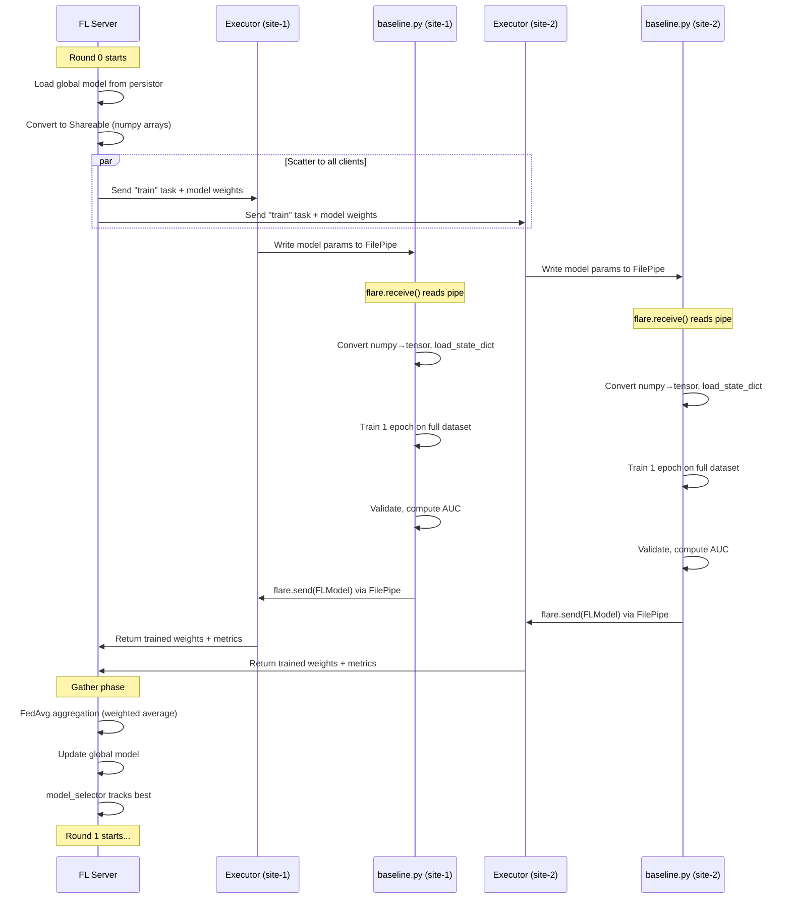

# NVFlare + MONAI ViT — Federated Learning Walkthrough

## Project Architecture

```
PPML-Experiments-FL/
├── data/NIH-Chest/                  # ~112K chest X-ray images across 12 folders
├── data_loader/nih_chest.py         # Dataset class + torchvision transforms
├── models/monai_vit.py              # MONAI ViT-Base wrapper
├── train/baseline.py                # Training script with NVFlare Client API hooks
├── test/baseline.py                 # Evaluation script
├── nvflare_job/                     # NVFlare job definition
│   ├── meta.json                    # Job metadata + deploy_map
│   └── app/config/
│       ├── config_fed_server.json   # Server-side FL orchestration
│       └── config_fed_client.json   # Client-side execution config
└── slurm_nvflare.sh                 # SLURM submission script
```

---

## 1. NVIDIA FLARE (NVFlare) Framework

### What is NVFlare?

NVIDIA FLARE (**F**ederated **L**earning **A**pplication **R**untime **E**nvironment) is an open-source framework for building federated learning systems. It provides:

- A **server** that orchestrates training rounds and aggregates model updates
- **Clients** that perform local training on their private data
- **Communication infrastructure** (pipes, cells) for secure model exchange
- A **simulator** that lets you test the entire FL workflow locally on a single machine

### How We're Using It: The Simulator

We're using `nvflare simulator`, which spins up the following **on a single SLURM node**:

```
┌─────────────────────────────────────────────────────────────────┐
│                     SLURM Node (mdc-1057-18-1)                  │
│                                                                 │
│  ┌─────────────────────────────────────────────────────────┐    │
│  │                  NVFlare Simulator                       │    │
│  │                                                         │    │
│  │   ┌──────────────┐                                      │    │
│  │   │   FL Server   │ ◄── Orchestrates rounds,            │    │
│  │   │              │     aggregates weights               │    │
│  │   └──────┬───────┘                                      │    │
│  │          │                                              │    │
│  │    ┌─────┴─────┐                                        │    │
│  │    │           │                                        │    │
│  │  ┌─┴──────┐  ┌─┴──────┐                                │    │
│  │  │ site-1 │  │ site-2 │  ◄── Simulated FL clients       │    │
│  │  │(Client)│  │(Client)│      (each runs baseline.py)    │    │
│  │  └────────┘  └────────┘                                 │    │
│  └─────────────────────────────────────────────────────────┘    │
│                                                                 │
│  Command: nvflare simulator nvflare_job -w /tmp/nvflare_workspace -n 2 -t 2  │
│           └─ job folder ─┘   └─ workspace ─┘  └ 2 clients ┘ └ 2 threads ┘   │
└─────────────────────────────────────────────────────────────────┘
```

- `-n 2`: Simulates **2 federated clients** (site-1, site-2)
- `-t 2`: Uses **2 threads** (one per client)
- `-w /tmp/nvflare_workspace`: Temporary workspace for the simulation

> [!NOTE]
> In a real-world deployment, each client would be on a separate machine (e.g., a different hospital), each with its own local dataset partition. The simulator runs everything on one node for development and testing.

---

## 2. NVFlare Configuration Deep Dive

### [meta.json](file:///Users/reeshavacharya/CIRCE/PPML-Experiments-FL/nvflare_job/meta.json) — Job Metadata

```json
{
  "name": "vit_fl",
  "resource_spec": {},
  "deploy_map": {
    "app": ["@ALL"]
  }
}
```

- `deploy_map`: Tells NVFlare to deploy the `app/` folder to **all participants** (server + all clients). Without this, the simulator doesn't know how to distribute config files.

---

### [config_fed_server.json](file:///Users/reeshavacharya/CIRCE/PPML-Experiments-FL/nvflare_job/app/config/config_fed_server.json) — Server Configuration

This is the brain of the FL system. It defines:

#### Global Settings
```json
"MIN_CLIENTS": 2,     // Wait for both clients before aggregating
"num_rounds": 5,      // Total FL communication rounds
```

#### Components

| Component | Class | Purpose |
|-----------|-------|---------|
| **persistor** | `PTFileModelPersistor` | Manages the global model on the server side. Initializes the starting weights using `MONAIViTWrapper(num_classes=14)` |
| **shareable_generator** | `FullModelShareableGenerator` | Converts the model's `state_dict` into a serializable "Shareable" (NVFlare's data exchange format), and vice versa |
| **aggregator** | `InTimeAccumulateWeightedAggregator` | Performs **Federated Averaging (FedAvg)** — weighted averaging of client model updates based on data contribution |
| **model_selector** | `IntimeModelSelector` | Tracks the best global model across rounds based on client-reported metrics |

#### Workflow: Scatter and Gather

```json
"workflows": [{
  "id": "scatter_and_gather",
  "path": "nvflare.app_common.workflows.scatter_and_gather.ScatterAndGather",
  "args": {
    "min_clients": 2,
    "num_rounds": 5,
    "train_task_name": "train"
  }
}]
```

This is the **FedAvg** (Federated Averaging) workflow:
1. **Scatter**: Server sends the current global model to all clients
2. **Wait**: Server waits for `min_clients` (2) to respond
3. **Gather**: Server collects trained models from all clients and aggregates them

---

### [config_fed_client.json](file:///Users/reeshavacharya/CIRCE/PPML-Experiments-FL/nvflare_job/app/config/config_fed_client.json) — Client Configuration

#### Executor
```json
"executor": {
  "path": "nvflare.app_common.executors.client_api_launcher_executor.ClientAPILauncherExecutor",
  "args": {
    "launcher_id": "launcher",
    "pipe_id": "pipe",
    "heartbeat_timeout": 600
  }
}
```

The `ClientAPILauncherExecutor` is the bridge between NVFlare's internal task system and your Python training script. When the server sends a "train" task:
1. It launches your script as a **subprocess**
2. Communicates via **FilePipe** (file-based message passing)
3. Monitors heartbeats to detect crashes

#### Components

| Component | Class | Purpose |
|-----------|-------|---------|
| **launcher** | `SubprocessLauncher` | Launches `python3 /work/.../train/baseline.py` as a subprocess. `launch_once: true` means the process persists across rounds |
| **pipe** | `FilePipe` | File-based IPC between the NVFlare executor and the Python subprocess. Creates temp files in the workspace for message exchange |

---

## 3. The Data Pipeline

### Dataset: NIH Chest X-ray

- **112,120 frontal-view chest X-ray images** from 30,805 unique patients
- **14 disease labels**: Atelectasis, Cardiomegaly, Effusion, Infiltration, Mass, Nodule, Pneumonia, Pneumothorax, Consolidation, Edema, Emphysema, Fibrosis, Pleural_Thickening, Hernia
- **Multi-label**: Each image can have 0 or more diseases (encoded as a 14-dim binary vector)
- Splits: **Train** (90% of train_val_list) / **Val** (10%) / **Test** (test_list.txt)

### Data Loading ([nih_chest.py](file:///Users/reeshavacharya/CIRCE/PPML-Experiments-FL/data_loader/nih_chest.py))

```
Raw Image (grayscale .png)
    │
    ▼
PIL.Image.open().convert("RGB")     ← Grayscale → 3-channel RGB
    │
    ▼
transforms.Resize((224, 224))       ← Resize to ViT input size
    │
    ▼
transforms.RandomHorizontalFlip()   ← Data augmentation (train only)
    │
    ▼
transforms.ToTensor()               ← [0,255] uint8 → [0,1] float32
    │
    ▼
transforms.Normalize(               ← ImageNet normalization
    mean=[0.485, 0.456, 0.406],
    std=[0.229, 0.224, 0.225]
)
    │
    ▼
{"image": tensor(3,224,224), "label": tensor(14)}  ← Dict output
```

> [!IMPORTANT]
> **Why convert grayscale to 3-channel?** The ViT model expects 3-channel (RGB) input. For grayscale X-rays, we replicate the single channel 3 times via `PIL.convert("RGB")`. This is standard practice in medical imaging with pretrained vision models.

> [!NOTE]
> **Both simulated clients use the same full dataset.** In a real deployment, each hospital client would have its own private data partition. The simulator doesn't partition data — it's testing the FL communication protocol.

---

## 4. The Model: MONAI ViT-Base

### Architecture ([monai_vit.py](file:///Users/reeshavacharya/CIRCE/PPML-Experiments-FL/models/monai_vit.py))

```
Input Image: (B, 3, 224, 224)
    │
    ▼
┌──────────────────────────────────────┐
│         Patch Embedding (Conv2D)      │
│  (3, 224, 224) → (196, 768)          │
│  16×16 patches = 14×14 = 196 tokens  │
│  + 1 CLS token = 197 tokens          │
└──────────────┬───────────────────────┘
               │
    ┌──────────┴──────────┐
    │  Learnable Position  │
    │     Embeddings       │
    │   (197, 768)         │
    └──────────┬──────────┘
               │
    ┌──────────┴──────────┐
    │   12 × Transformer   │ ← ViT-Base: 12 layers
    │      Blocks          │
    │  ┌────────────────┐  │
    │  │ Multi-Head Self │  │    12 heads, dim=768
    │  │   Attention     │  │    head_dim = 64
    │  ├────────────────┤  │
    │  │  Layer Norm     │  │
    │  ├────────────────┤  │
    │  │     MLP         │  │    768 → 3072 → 768
    │  │  (GELU)         │  │
    │  ├────────────────┤  │
    │  │  Layer Norm     │  │
    │  └────────────────┘  │
    └──────────┬──────────┘
               │
    ┌──────────┴──────────┐
    │   Classification     │
    │      Head            │
    │  CLS token → Linear  │
    │  768 → 14 (logits)   │
    │  + Tanh activation   │
    └──────────┬──────────┘
               │
               ▼
    Output: (B, 14) logits
```

- **~86M parameters** (ViT-Base)
- **`MONAIViTWrapper`**: Wraps MONAI's ViT to return only the logits (discarding hidden states), making it compatible with standard PyTorch training loops
- **Loss**: `BCEWithLogitsLoss` — combines sigmoid + binary cross-entropy for multi-label classification

---

## 5. The Federated Training Loop

### Complete Lifecycle of One FL Round

Here's what happens during a single round of federated learning, mapped to what you see in the logs:



### Step-by-Step in Code

#### 1. Server Initializes (log lines 1-5)
```
Initializing ScatterAndGather workflow for Federated Averaging.
Using the default model weights initialized on the persistor side.
Round 0 started.
```
The `PTFileModelPersistor` instantiates `MONAIViTWrapper(num_classes=14)` and extracts its `state_dict()` as the initial global model. Since no pre-trained checkpoint was provided, these are **random weights**.

#### 2. Clients Launch (log lines 6-17)
```
_start_external_process: launching new subprocess
execute for task (train)
Launcher successfully launched task (train).
```
The `SubprocessLauncher` spawns `python3 baseline.py` as a child process. The `ClientAPILauncherExecutor` serializes the global model weights into the `FilePipe` directory.

#### 3. Training Script Starts (log lines 24-33)
```
Using device: cuda
Data loaders created: Train (2434 batches), Val (271 batches), Test (800 batches)
--- Starting FL Round 0 ---
Loaded global model parameters.
Round 0 - Local Epoch 1/1
```

Inside [baseline.py](file:///Users/reeshavacharya/CIRCE/PPML-Experiments-FL/train/baseline.py):

```python
# Module-level: immediate handshake with NVFlare
flare.init()

def train():
    while flare.is_running():
        input_model = flare.receive()     # ← Blocks until server sends model
        
        # Convert numpy→tensor (NVFlare sends numpy by default)
        params = {k: torch.as_tensor(v) for k, v in input_model.params.items()}
        model.load_state_dict(params)
        
        # Standard PyTorch training loop
        for epoch in range(1, epochs + 1):
            for batch in train_loader:
                images, labels = batch["image"].to(device), batch["label"].to(device)
                outputs = model(images)
                loss = criterion(outputs, labels)
                loss.backward()
                optimizer.step()
        
        # Send back to server
        output_model = flare.FLModel(
            params=model.cpu().state_dict(),
            metrics={"val_auc": val_auc}
        )
        flare.send(output_model)          # ← Server receives this
```

#### 4. FedAvg Aggregation (happens on server after both clients report)

The `InTimeAccumulateWeightedAggregator` performs **Federated Averaging**:

```
global_weights[layer] = Σ(client_weights[layer] × client_data_size) / Σ(client_data_size)
```

Since both simulated clients use the same dataset (same size), this simplifies to:
```
global_weights = (site1_weights + site2_weights) / 2
```

#### 5. Repeat for 5 Rounds

The server then sends the aggregated model back to both clients, and the cycle repeats for all 5 rounds.

---

## 6. Communication: How FilePipe Works

```
NVFlare Executor (CJ process)          Training Script (subprocess)
        │                                        │
        │  ── Write model params to ──►          │
        │     /tmp/nvflare_workspace/            │
        │     site-1/simulate_job/               │
        │     pipe_files/                        │
        │                                        │
        │                              flare.receive()
        │                              ◄── Reads pipe file ──
        │                                        │
        │                              ... trains ...
        │                                        │
        │                              flare.send(model)
        │  ◄── Reads result from pipe ──         │
        │                                        │
        ▼                                        ▼
```

The `FilePipe` uses the filesystem for IPC:
- **PASSIVE mode** (executor side): Waits for messages
- **ACTIVE mode** (subprocess side, set by `flare.init()`): Writes messages
- Heartbeat files are periodically touched to signal liveness

---

## 7. What's Currently Running

Based on the latest logs at **17:43**:

| Metric | Value |
|--------|-------|
| **FL Round** | 0 of 5 |
| **Local Epoch** | 1 of 1 |
| **Training Progress** | ~30% (both clients) |
| **Batch Size** | 32 |
| **Total Train Batches** | 2,434 per client |
| **Processing Speed** | ~10% every 1.5 min |
| **Estimated time per round** | ~15 min training + ~2 min validation |
| **Estimated total job time** | ~85 min for all 5 rounds |

### Current Training Configuration

| Parameter | Value |
|-----------|-------|
| FL Rounds | 5 |
| Local Epochs per Round | 1 |
| Batch Size | 32 |
| Optimizer | AdamW (lr=1e-4, weight_decay=1e-4) |
| Scheduler | ReduceLROnPlateau (patience=2, factor=0.1) |
| Loss | BCEWithLogitsLoss |
| Metric | Macro AUC (ROC) |
| Aggregation | FedAvg (weighted average) |
